# Stubrix


## One mock structure, two engines, one control panel

[](https://github.com/marcelo-davanco/stubrix)
[](https://www.docker.com/)
[](https://wiremock.org/)
[](https://mockoon.com/)
[](https://nestjs.com/)
[](https://react.dev/)
[](LICENSE)

Unified container for running **WireMock** or **Mockoon CLI**, both sharing the same mock structure.
Includes a **control panel** (API + Dashboard) for managing mocks, projects, recordings, logs, and database snapshots visually.

---

## 🏆 Key Differentials

| Differential | Description |
|---|---|
| **Dual-Engine, Zero Lock-in** | Same mocks run on WireMock (Java) or Mockoon (Node.js) — switch with one command |
| **Database Snapshot Control** | Project-scoped snapshot/restore for PostgreSQL (real `pg_dump`/`psql`), MySQL, SQLite — manage state alongside mocks |
| **AI-Ready (MCP Servers)** | 3 custom [Model Context Protocol](https://modelcontextprotocol.io/) servers with **55+ tools** for AI-assisted mock management from your IDE |
| **4 Recording Modes** | Auto, API, Snapshot, Dashboard UI — create mocks from real API traffic effortlessly |
| **Micro Frontend Architecture** | Modular UI with `@stubrix/db-ui` micro frontend; extensible pattern for future modules |
| **Full Visual Control** | NestJS 11 API + React 19 Dashboard — no CLI-only workflow required |
| **Project-Scoped Everything** | Mocks, recordings, database configs, and snapshots are all scoped to projects |

---

## Requirements

- Node.js 24
- npm 10+
- Docker (optional, for mock engines and database containers)
- PostgreSQL client tools (`pg_dump`, `psql`) if you want real PostgreSQL snapshot/restore

---

## 🏗️ Architecture Overview

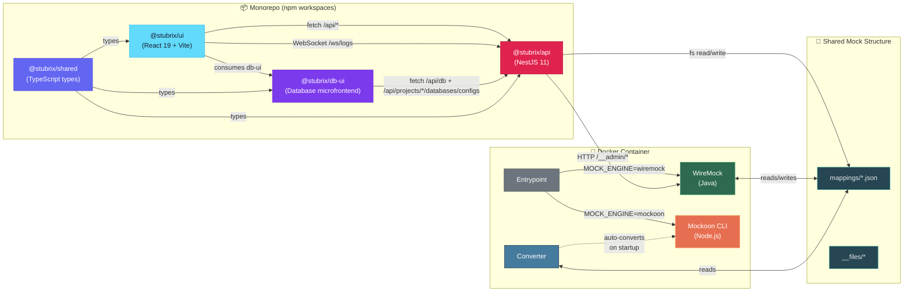

> **Canonical format** is WireMock (`mappings/` + `__files/`) — the simplest and most universal.
> When Mockoon is activated, the converter automatically generates the native format from mappings.

---

## 📂 Project Structure

```text
stubrix/
├── packages/
│   ├── shared/                    Shared TypeScript types (@stubrix/shared)
│   │   └── src/types/               Project, Mock, Log, Recording, Status
│   ├── api/                       NestJS control plane backend (@stubrix/api)
│   │   └── src/
│   │       ├── projects/            Project CRUD + JSON persistence
│   │       ├── mocks/               Mock CRUD + WireMock integration
│   │       ├── recording/           Start/stop/snapshot recording
│   │       ├── logs/                REST + WebSocket (Socket.IO)
│   │       ├── status/              Engine health + mock counts
│   │       ├── engine/              WireMock reset + status
│   │       └── databases/           Engines, database info, snapshots, project configs
│   ├── db-ui/                     Database microfrontend (@stubrix/db-ui)
│   │   └── src/
│   │       ├── components/          Database widgets and forms
│   │       ├── hooks/               Database state and project context
│   │       ├── lib/                 Database API client
│   │       └── pages/               Databases page
│   ├── ui/                        React dashboard (@stubrix/ui)
│   │   └── src/
│   │       ├── pages/               Dashboard, Projects, Mocks, Recording, Logs, Databases
│   │       ├── components/          Layout, Badge, shared UI
│   │       └── lib/                 API client, WebSocket client, utils
│   └── mcp/                       Custom MCP servers
│       ├── stubrix-mcp/             Full Stubrix API control (27 tools)
│       ├── wiremock-mcp/            Direct WireMock Admin API (16 tools)
│       └── docker-mcp/              Docker Compose management (12 tools)
│
├── mocks/                         Canonical mock structure
│   ├── mappings/                    Route definitions (JSON)
│   └── __files/                     Response body files

├── dumps/                         Snapshot output and database metadata
│   ├── postgres/
│   ├── mysql/
│   ├── sqlite/
│   ├── .snapshot-metadata.json
│   └── .project-databases.json
│
├── scripts/
│   ├── converter.js               WireMock <-> Mockoon converter
│   ├── entrypoint.sh              Smart Docker entrypoint
│   ├── record.sh                  Recording helper (Admin API)
│   └── import-from-recording.sh   Import mocks from container
│
├── Dockerfile                     Multi-engine Docker image
├── docker-compose.yml             4 profiles available
├── Makefile                       CLI shortcuts for everything
└── .env.example                   Environment variable reference
```

---

## 🖥️ Control Panel

The control panel provides a **visual interface** for managing the entire mock lifecycle — no manual JSON editing or curl commands required.

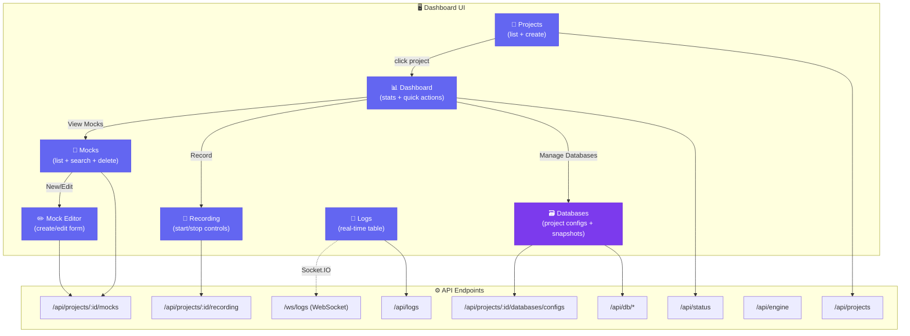

### Tech Stack

| Layer | Technology |
| ----- | ---------- |
| **API** | NestJS 11 + Express, WebSockets (Socket.IO) |
| **UI** | React 19 + Vite, TailwindCSS, Lucide icons, React Router |
| **Shared** | TypeScript lib consumed by both API and UI |
| **Validation** | class-validator + class-transformer with nested DTOs |

### Running the Control Panel

```bash
# Use the project Node version
asdf install
asdf current

# Install dependencies (from project root)
npm install

# Build everything
npm run build

# Start API (port 9090)
npm run dev:api

# Start UI dev server (port 5173, proxies to API)
npm run dev:ui
```

> The UI dev server proxies `/api/*` and `/ws/*` to the API at `localhost:9090`.
> In production, the UI builds directly into `packages/api/public/` for single-container serving.

---

## 🚀 Quick Start

### 1. Configure `.env`

```bash
cp .env.example .env
```

Edit as needed:

```dotenv
# Mock server port (host + container)
MOCK_PORT=8081

# Real API URL (for recording/proxy)
PROXY_TARGET=https://api.example.com

# CORS allowed origins (comma-separated, or * for all)
CORS_ORIGIN=*

# PostgreSQL
PG_HOST=localhost
PG_PORT=5442
PG_USER=postgres
PG_PASSWORD=postgres
PG_DATABASE=postgres

# MySQL
MYSQL_HOST=localhost
MYSQL_PORT=3307
MYSQL_USER=stubrix
MYSQL_PASSWORD=stubrix
MYSQL_DATABASE=stubrix

# SQLite (optional)
SQLITE_DB_PATH=

# Snapshot directory
DUMPS_DIR=./dumps
```

> The `.env` file is automatically loaded by `Makefile`, `docker-compose`, and scripts.

### 2. Build the image

```bash
make build
```

### 3. Choose an engine and start

```bash
make wiremock     # or
make mockoon
```

### 4. Test

```bash
curl http://localhost:8081/api/health
# → {"status": "ok", "engine": "mock-server"}
```

> To change the port without editing `.env`: `MOCK_PORT=9090 make wiremock`

---

## 🗃️ Databases Module

The Databases Module is now part of the main NestJS API and exposed in the dashboard through the `@stubrix/db-ui` microfrontend.

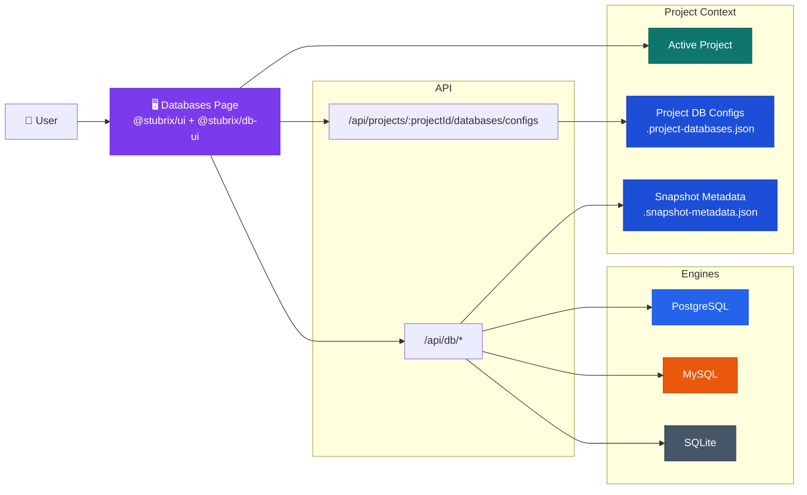

### What it supports today

- Multi-engine discovery:
  - PostgreSQL
  - MySQL
  - SQLite
- Project-scoped database configurations
- Project-scoped snapshot metadata
- Database inspection by engine and project
- Snapshot creation and restore

### Current engine status

| Engine | List / Info | Snapshot | Restore |
| ------ | ----------- | -------- | ------- |
| **PostgreSQL** | Real | Real (`pg_dump`) | Real (`psql`) |
| **MySQL** | Real | Placeholder | Placeholder |
| **SQLite** | Real | Placeholder | Placeholder |

### Project-aware persistence

Database state is persisted in the `dumps/` directory:

- `dumps/.project-databases.json`
  - project-scoped database configurations
- `dumps/.snapshot-metadata.json`
  - snapshot metadata including `projectId`
- `dumps/postgres/`, `dumps/mysql/`, `dumps/sqlite/`
  - generated snapshot files

### Main API routes

#### Project database configs

- `GET /api/projects/:projectId/databases/configs`
- `GET /api/projects/:projectId/databases/configs/:id`
- `POST /api/projects/:projectId/databases/configs`
- `DELETE /api/projects/:projectId/databases/configs/:id`

#### Engines and databases

- `GET /api/db/engines`
- `GET /api/db/databases?projectId=...`
- `GET /api/db/engines/:engine/databases?projectId=...`
- `GET /api/db/databases/:name/info?projectId=...`
- `GET /api/db/engines/:engine/databases/:name/info?projectId=...`

#### Snapshots

- `GET /api/db/snapshots?projectId=...`
- `POST /api/db/snapshots`
- `POST /api/db/engines/:engine/snapshots`
- `PATCH /api/db/snapshots/:name`
- `DELETE /api/db/snapshots/:name`
- `POST /api/db/snapshots/:name/restore`
- `POST /api/db/engines/:engine/snapshots/:name/restore`

### How project context works

- The dashboard selects an active project.
- Project database configs are loaded from `/api/projects/:projectId/databases/configs`.
- Database listing and inspection send `projectId` to `/api/db/*` routes.
- Snapshot creation includes `projectId` in metadata.
- Snapshot listing is filtered by `projectId`.

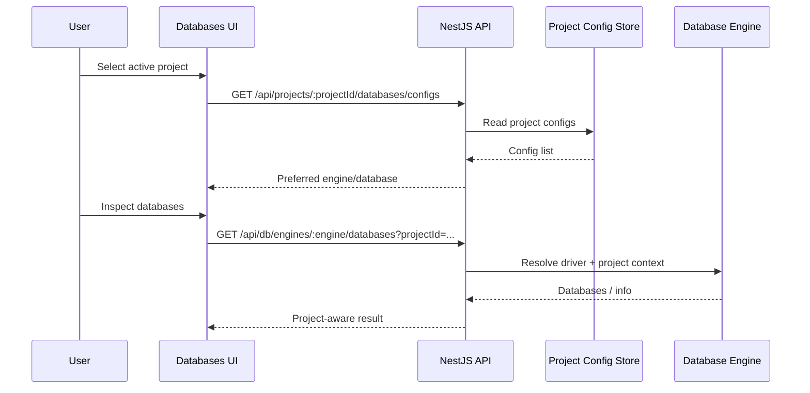

### Using the Databases panel

1. Open the dashboard and go to `Databases`.
2. Select the active project.
3. Create a database config for that project.
4. Inspect available databases for the selected engine.
5. Create snapshots in the context of the active project.
6. Restore PostgreSQL snapshots when needed.

### PostgreSQL requirements for real snapshot/restore

To use real PostgreSQL dump/restore, your environment must provide:

- `pg_dump`
- `psql`

The module uses the following variables:

- `PG_HOST`
- `PG_PORT`
- `PG_USER`
- `PG_PASSWORD`
- `PG_DATABASE`

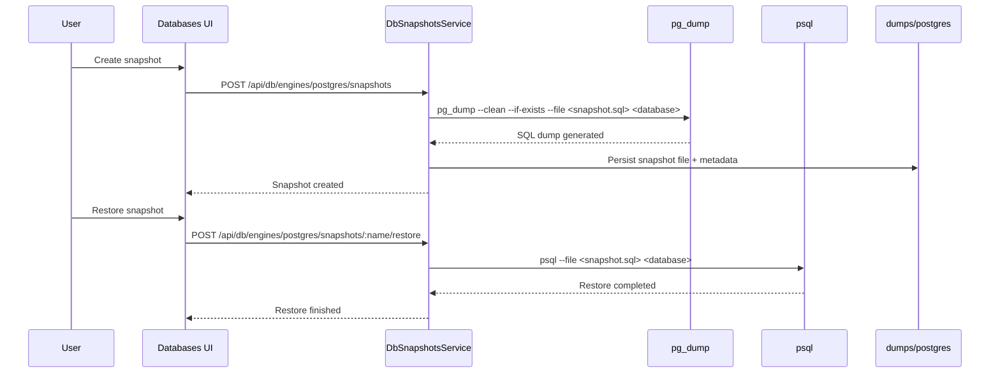

### Example manual test flow

```bash
# 1. install dependencies
npm install

# 2. build all packages
npm run build

# 3. start the API
npm run dev:api

# 4. start the UI
npm run dev:ui
```

Then in the UI:

1. Create or select a project.
2. Open `Databases`.
3. Add a PostgreSQL config for the project.
4. Create a snapshot.
5. Confirm the dump file exists in `dumps/postgres/`.
6. Restore the snapshot to a valid PostgreSQL database.

---

## 🤖 MCP Ecosystem (AI-Assisted Mock Management)

Stubrix includes **3 custom Model Context Protocol (MCP) servers** with **55+ tools**, enabling AI coding assistants (Windsurf Cascade, Cursor, etc.) to manage mocks, databases, and infrastructure directly from your IDE.

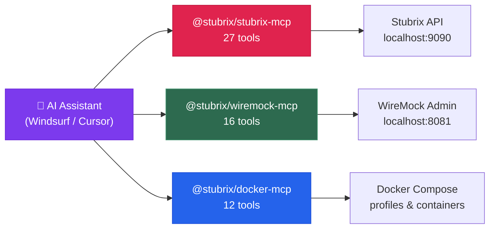

### Available MCP Servers

| Server | Tools | Coverage |
|--------|-------|----------|
| **@stubrix/stubrix-mcp** | 27 | Projects, mocks, recording, databases, snapshots, configs |
| **@stubrix/wiremock-mcp** | 16 | Mappings, recording, requests, server state |
| **@stubrix/docker-mcp** | 12 | Compose up/down, logs, health, exec, volumes |

### Example AI Interactions

```
You: "Create a GET /api/users mock that returns 3 users"
→ AI calls stubrix_create_mock(...)

You: "Take a snapshot of the postgres database before I run migrations"
→ AI calls stubrix_create_snapshot(...)

You: "Start recording against the staging API"
→ AI calls stubrix_start_recording(...)

You: "Spin up WireMock and check if it's healthy"
→ AI calls docker_compose_up(["wiremock"]) + docker_health()
```

### Setup

Add to your MCP configuration (e.g., `~/.codeium/windsurf/mcp_config.json`):

```json
{
  "mcpServers": {
    "stubrix-mcp": {
      "command": "node",
      "args": ["packages/mcp/stubrix-mcp/src/index.js"],
      "env": { "STUBRIX_API_URL": "http://localhost:9090" }
    },
    "wiremock-mcp": {
      "command": "node",
      "args": ["packages/mcp/wiremock-mcp/src/index.js"],
      "env": { "WIREMOCK_URL": "http://localhost:8081" }
    },
    "docker-mcp": {
      "command": "node",
      "args": ["packages/mcp/docker-mcp/src/index.js"],
      "env": { "COMPOSE_PROJECT_DIR": "/path/to/stubrix" }
    }
  }
}
```

> Full documentation: [`packages/mcp/README.md`](packages/mcp/README.md)

---

## 🎥 Mock Recording

The most important feature. Allows **creating mocks automatically** from a real API.

### How recording works

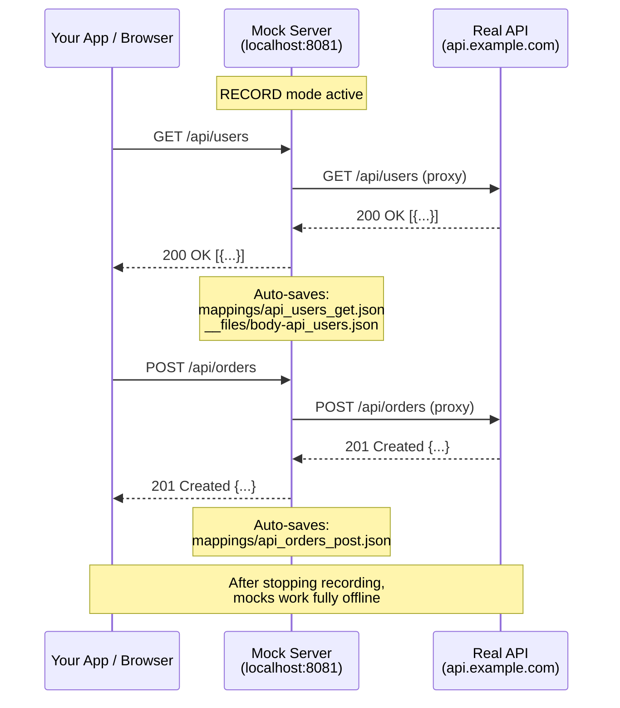

---

### Option A — Automatic Recording (simplest)

Everything passing through the proxy is recorded automatically.

```bash
# 1. Start in recording mode pointing to the real API
make wiremock-record PROXY_TARGET=https://api.example.com

# 2. Make requests normally
curl http://localhost:8081/api/users
curl http://localhost:8081/api/products/42
curl -X POST http://localhost:8081/api/orders -d '{"item":"abc"}'

# 3. Stop the container
make down

# 4. Done! Mocks saved in mocks/mappings/
make list-mappings
```

### Option B — Recording via API (more control)

Start/stop recording on demand without restarting the container.

```bash
# 1. Start WireMock normally
make wiremock

# 2. In another terminal, start recording
./scripts/record.sh start https://api.example.com

# 3. Make your calls
curl http://localhost:8081/api/users
curl http://localhost:8081/api/config

# 4. Stop recording (mocks are persisted)
./scripts/record.sh stop

# 5. Check recorded mocks
make list-mappings
```

### Option C — Snapshot (point-in-time capture)

Captures the current state of all responses without continuous recording.

```bash
./scripts/record.sh snapshot
```

### Option D — Via Control Panel

Use the dashboard UI to manage recordings visually:

1. Open `http://localhost:5173` (dev) or `http://localhost:9090` (production)
2. Navigate to a project → **Recording**
3. Enter the proxy target URL and click **Start Recording**
4. Make requests against `localhost:8081`
5. Click **Stop** or **Snapshot** to persist mocks

---

## 🔄 Complete Workflow

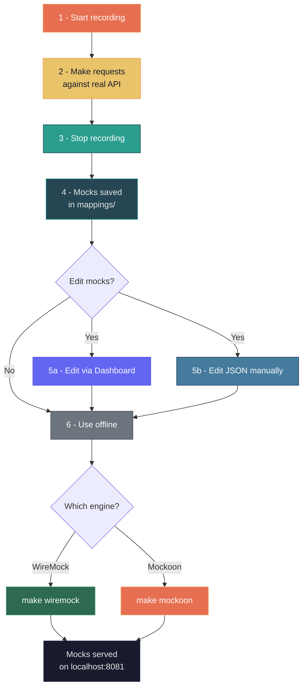

---

## 🔀 Proxy Mode (Mockoon)

Mockoon can work in **hybrid proxy mode**: routes with a defined mock return the mock, routes without one are forwarded to the real API.

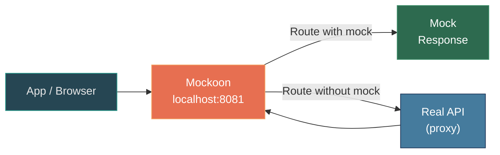

```bash
make mockoon-proxy PROXY_TARGET=https://api.example.com
```

---

## 📋 Mock Anatomy

### Inline body

```json
{
  "request": {
    "method": "GET",
    "url": "/api/health"
  },
  "response": {
    "status": 200,
    "headers": {
      "Content-Type": "application/json"
    },
    "body": "{\"status\": \"ok\"}"
  }
}
```

> Saved at `mocks/mappings/api_health_get.json`

### External body file

```json
{
  "request": {
    "method": "GET",
    "url": "/api/users"
  },
  "response": {
    "status": 200,
    "headers": {
      "Content-Type": "application/json"
    },
    "bodyFileName": "users.json"
  }
}
```

> Mapping at `mocks/mappings/api_users_get.json`
> Body at `mocks/__files/users.json`

---

## 🔄 Format Conversion

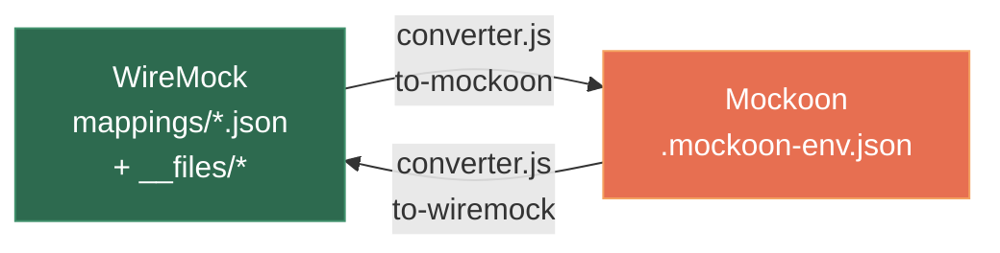

```bash
# WireMock → Mockoon
make convert-to-mockoon

# Mockoon → WireMock
make convert-to-wiremock
```

> Conversion to Mockoon format happens **automatically** when the Mockoon engine starts. You only need to run it manually if you want to inspect or edit the generated file.

---

## 📖 Command Reference

### Serving Mocks

| Command | Engine | Description |
| ------- | ------ | ----------- |
| `make wiremock` | WireMock | Serve existing mocks |
| `make mockoon` | Mockoon | Serve existing mocks (auto-converts) |

### Recording

| Command | Description |
| ------- | ----------- |
| `make wiremock-record PROXY_TARGET=<url>` | Start WireMock recording all proxied requests |
| `./scripts/record.sh start <url>` | Start recording via Admin API |
| `./scripts/record.sh stop` | Stop recording and persist mocks |
| `./scripts/record.sh snapshot` | Point-in-time capture of current state |
| `./scripts/record.sh status` | Check if recording is active |

### Proxy

| Command | Description |
| ------- | ----------- |
| `make mockoon-proxy PROXY_TARGET=<url>` | Mockoon hybrid: mock + proxy |

### Conversion

| Command | Description |
| ------- | ----------- |
| `make convert-to-mockoon` | Generate `.mockoon-env.json` from mappings |
| `make convert-to-wiremock` | Generate mappings from `.mockoon-env.json` |

### Utilities

| Command | Description |
| ------- | ----------- |
| `make build` | Build Docker image |
| `make down` | Stop all containers |
| `make list-mappings` | List mocks and body files |
| `make clean` | Remove containers and generated files |
| `make clean-mocks` | Remove **all** mocks (careful!) |
| `make help` | List all available commands |

---

## 🔄 Issue Management & Documentation

Stubrix follows a structured issue management workflow to ensure proper documentation and project tracking.

### Issue Closure Process

After a PR is merged, all related issues must be properly closed with comprehensive documentation:

```bash
# Close a single issue with documentation
npm run close-issue [PR_NUMBER] [ISSUE_NUMBER] [VERSION]

# Example: Close issue #19 from PR #28 in version 1.1.0
npm run close-issue 28 19 1.1.0

# Close multiple issues at once
npm run close-issues [PR_NUMBER] [VERSION] [ISSUE1] [ISSUE2] ...

# Example: Batch close multiple issues from PR #28
npm run close-issues 28 1.1.0 19 22
```

### Automated Issue Documentation

The issue closure script automatically:

- ✅ Verifies all acceptance criteria are met
- ✅ Extracts implementation details from the PR
- ✅ Generates comprehensive documentation
- ✅ References PR number and version
- ✅ Documents testing coverage
- ✅ Closes the issue with proper status

### Issue Closure Template

Each closed issue follows this standardized format:

```markdown
## ✅ **COMPLETED** - [Feature Name]

### **Delivered in PR #[PR_NUMBER]:** [PR Title](PR_URL)

---

### 🎯 **What was implemented:**

#### **✅ All Acceptance Criteria Met:**
- [x] [Criterion 1]
- [x] [Criterion 2]
- [x] [Criterion 3]

#### **🔧 Technical Implementation:**
- **Implementation Detail 1**: Description
- **Implementation Detail 2**: Description
- **Implementation Detail 3**: Description

#### **🧪 Testing Coverage:**
- **X unit tests** covering functionality
- **Edge cases** and error scenarios

---

### 🚀 **Impact:**
- **Benefit 1**: Description of user value
- **Benefit 2**: Description of technical improvement
- **Developer Experience**: How this improves DX

**Issue #[ISSUE_NUMBER] has been successfully completed and merged into main v[VERSION]!** 🎯
```

### Workflow Integration

This process integrates with:

- **Version Management**: Run after version bump
- **Release Process**: Part of release checklist  
- **Project Management**: Ensures proper issue tracking
- **Documentation**: Maintains project history

> 📋 **Full workflow documentation**: [`.windsurf/workflows/issue-closure.md`](.windsurf/workflows/issue-closure.md)

---

## ⚙️ Environment Variables

| Variable | Default | Description |
| -------- | ------- | ----------- |
| `MOCK_PORT` | `8081` | Port on host and inside container |
| `PROXY_TARGET` | — | Real API URL for proxy/recording |
| `MOCK_ENGINE` | `wiremock` | Engine: `wiremock` or `mockoon` |
| `RECORD_MODE` | `false` | Enable automatic recording (WireMock) |
| `CONTROL_PORT` | `9090` | Control panel API port |
| `CORS_ORIGIN` | `*` | Allowed CORS origins (comma-separated) |

> All variables can be set in `.env` (auto-loaded) or passed inline: `MOCK_PORT=9090 make wiremock`

---

## 🐳 Docker Compose — Profiles

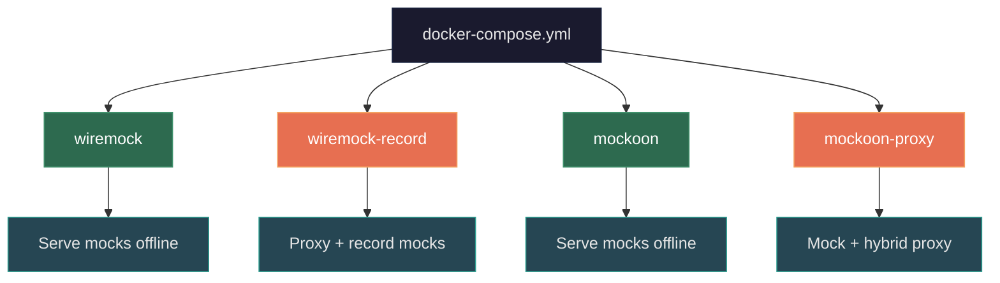

```bash
# Direct usage (without Makefile)
docker compose --profile wiremock up
docker compose --profile mockoon up
PROXY_TARGET=https://api.example.com docker compose --profile wiremock-record up
PROXY_TARGET=https://api.example.com docker compose --profile mockoon-proxy up
```

---

## 💡 Use Cases

### Offline Development

> I need to work without internet but my app depends on 3 external APIs.

```bash
# 1. With internet, record mocks for each API
make wiremock-record PROXY_TARGET=https://api-users.example.com
# use your app... then stop
make down

# 2. Repeat for other APIs or use the Recording page in the dashboard

# 3. Without internet, serve the mocks
make wiremock
```

### Integration Tests in CI

> I need stable mocks in my CI pipeline.

```bash
# Record once locally, commit the mocks
make wiremock-record PROXY_TARGET=https://staging.api.com
make down
git add mocks/ && git commit -m "add API mocks"

# In CI
docker compose --profile wiremock up -d
npm test
docker compose --profile wiremock down
```

### Switch Engines Without Rework

> The team decided to migrate from WireMock to Mockoon (or vice-versa).

```bash
# Same mocks, different engine
make wiremock   # before
make mockoon    # after — zero changes to mocks
```

---

## 📚 Guides

| Guide | Description |
| ----- | ----------- |
| [Recording with PokéAPI + Postman](docs/guide-pokeapi-recording.md) | Full walkthrough: record PokéAPI mocks, serve offline, and use via Postman Collection |

---

## 📄 License

MIT — see [LICENSE](LICENSE) for details.

---

**Stubrix** — made with ☕ by [Marcelo Davanço](https://github.com/marcelo-davanco)
