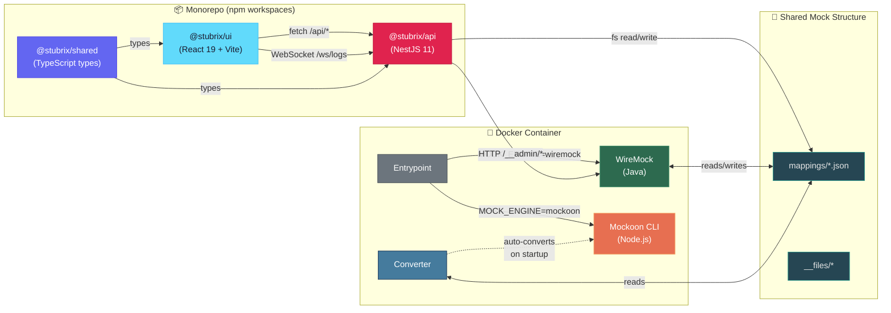
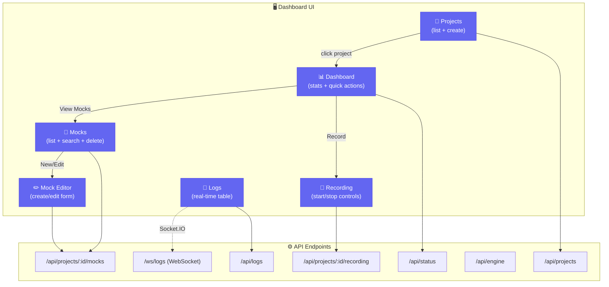
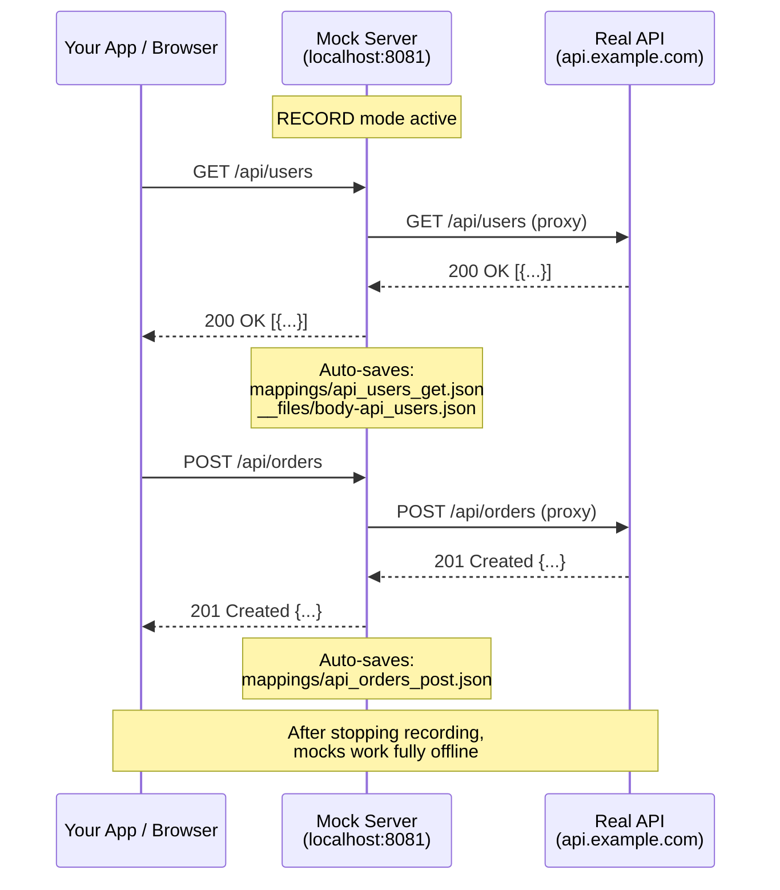
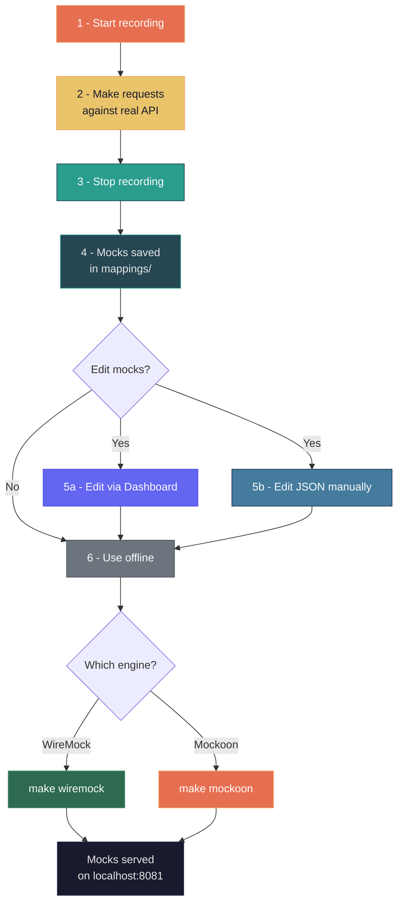
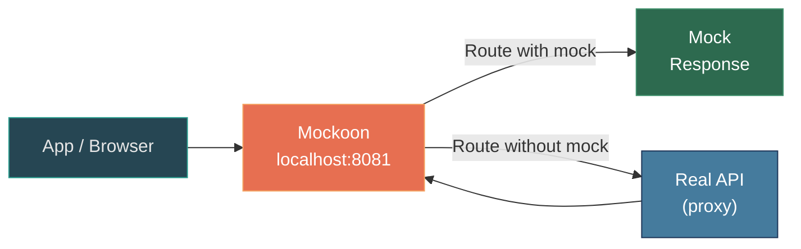
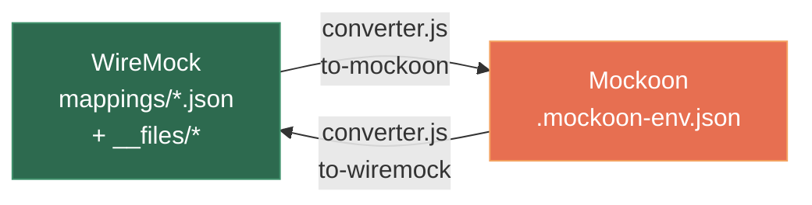
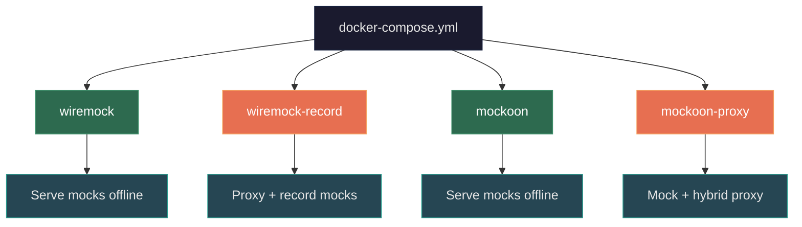

<div align="center">


# Stubrix

### One mock structure, two engines, one control panel

[](https://github.com/marcelo-davanco/stubrix)
[](#-quick-start)
[](#-mock-engines)
[](#-mock-engines)
[](#-control-panel)
[](#-control-panel)
[](LICENSE)

Unified container for running **WireMock** or **Mockoon CLI**, both sharing the same mock structure.
Includes a **control panel** (API + Dashboard) for managing mocks, projects, recordings, and logs visually.

</div>

---

## 🏗️ Architecture Overview



> **Canonical format** is WireMock (`mappings/` + `__files/`) — the simplest and most universal.
> When Mockoon is activated, the converter automatically generates the native format from mappings.

---

## 📂 Project Structure

```
stubrix/
├── packages/
│   ├── shared/                    Shared TypeScript types (@stubrix/shared)
│   │   └── src/types/               Project, Mock, Log, Recording, Status
│   ├── api/                       NestJS control plane backend (@stubrix/api)
│   │   └── src/
│   │       ├── projects/            Project CRUD + JSON persistence
│   │       ├── mocks/               Mock CRUD + WireMock integration
│   │       ├── recording/           Start/stop/snapshot recording
│   │       ├── logs/                REST + WebSocket (Socket.IO)
│   │       ├── status/              Engine health + mock counts
│   │       └── engine/              WireMock reset + status
│   └── ui/                        React dashboard (@stubrix/ui)
│       └── src/
│           ├── pages/               Dashboard, Projects, Mocks, Recording, Logs
│           ├── components/          Layout, Badge, shared UI
│           └── lib/                 API client, WebSocket client, utils
│
├── mocks/                         Canonical mock structure
│   ├── mappings/                    Route definitions (JSON)
│   └── __files/                     Response body files
│
├── scripts/
│   ├── converter.js               WireMock <-> Mockoon converter
│   ├── entrypoint.sh              Smart Docker entrypoint
│   ├── record.sh                  Recording helper (Admin API)
│   └── import-from-recording.sh   Import mocks from container
│
├── Dockerfile                     Multi-engine Docker image
├── docker-compose.yml             4 profiles available
├── Makefile                       CLI shortcuts for everything
└── .env.example                   Environment variable reference
```

---

## 🖥️ Control Panel

The control panel provides a **visual interface** for managing the entire mock lifecycle — no manual JSON editing or curl commands required.



### Tech Stack

| Layer | Technology |
|:------|:-----------|
| **API** | NestJS 11 + Express, WebSockets (Socket.IO) |
| **UI** | React 19 + Vite, TailwindCSS, Lucide icons, React Router |
| **Shared** | TypeScript lib consumed by both API and UI |
| **Validation** | class-validator + class-transformer with nested DTOs |

### Running the Control Panel

```bash
# Install dependencies (from project root)
npm install

# Build shared types
npm run build --workspace=@stubrix/shared

# Start API (port 9090)
npm run start:dev --workspace=@stubrix/api

# Start UI dev server (port 5173, proxies to API)
npm run dev --workspace=@stubrix/ui
```

> The UI dev server proxies `/api/*` and `/ws/*` to the API at `localhost:9090`.
> In production, the UI builds directly into `packages/api/public/` for single-container serving.

---

## 🚀 Quick Start

### 1. Configure `.env`

```bash
cp .env.example .env
```

Edit as needed:

```dotenv
# Mock server port (host + container)
MOCK_PORT=8081

# Real API URL (for recording/proxy)
PROXY_TARGET=https://api.example.com

# CORS allowed origins (comma-separated, or * for all)
CORS_ORIGIN=*
```

> The `.env` file is automatically loaded by `Makefile`, `docker-compose`, and scripts.

### 2. Build the image

```bash
make build
```

### 3. Choose an engine and start

```bash
make wiremock     # or
make mockoon
```

### 4. Test

```bash
curl http://localhost:8081/api/health
# → {"status": "ok", "engine": "mock-server"}
```

> To change the port without editing `.env`: `MOCK_PORT=9090 make wiremock`

---

## 🎥 Mock Recording

The most important feature. Allows **creating mocks automatically** from a real API.

### How recording works



---

### Option A — Automatic Recording (simplest)

Everything passing through the proxy is recorded automatically.

```bash
# 1. Start in recording mode pointing to the real API
make wiremock-record PROXY_TARGET=https://api.example.com

# 2. Make requests normally
curl http://localhost:8081/api/users
curl http://localhost:8081/api/products/42
curl -X POST http://localhost:8081/api/orders -d '{"item":"abc"}'

# 3. Stop the container
make down

# 4. Done! Mocks saved in mocks/mappings/
make list-mappings
```

### Option B — Recording via API (more control)

Start/stop recording on demand without restarting the container.

```bash
# 1. Start WireMock normally
make wiremock

# 2. In another terminal, start recording
./scripts/record.sh start https://api.example.com

# 3. Make your calls
curl http://localhost:8081/api/users
curl http://localhost:8081/api/config

# 4. Stop recording (mocks are persisted)
./scripts/record.sh stop

# 5. Check recorded mocks
make list-mappings
```

### Option C — Snapshot (point-in-time capture)

Captures the current state of all responses without continuous recording.

```bash
./scripts/record.sh snapshot
```

### Option D — Via Control Panel

Use the dashboard UI to manage recordings visually:

1. Open `http://localhost:5173` (dev) or `http://localhost:9090` (production)
2. Navigate to a project → **Recording**
3. Enter the proxy target URL and click **Start Recording**
4. Make requests against `localhost:8081`
5. Click **Stop** or **Snapshot** to persist mocks

---

## 🔄 Complete Workflow



---

## 🔀 Proxy Mode (Mockoon)

Mockoon can work in **hybrid proxy mode**: routes with a defined mock return the mock, routes without one are forwarded to the real API.



```bash
make mockoon-proxy PROXY_TARGET=https://api.example.com
```

---

## 📋 Mock Anatomy

### Inline body

```json
{
  "request": {
    "method": "GET",
    "url": "/api/health"
  },
  "response": {
    "status": 200,
    "headers": {
      "Content-Type": "application/json"
    },
    "body": "{\"status\": \"ok\"}"
  }
}
```

> Saved at `mocks/mappings/api_health_get.json`

### External body file

```json
{
  "request": {
    "method": "GET",
    "url": "/api/users"
  },
  "response": {
    "status": 200,
    "headers": {
      "Content-Type": "application/json"
    },
    "bodyFileName": "users.json"
  }
}
```

> Mapping at `mocks/mappings/api_users_get.json`
> Body at `mocks/__files/users.json`

---

## 🔄 Format Conversion



```bash
# WireMock → Mockoon
make convert-to-mockoon

# Mockoon → WireMock
make convert-to-wiremock
```

> Conversion to Mockoon format happens **automatically** when the Mockoon engine starts. You only need to run it manually if you want to inspect or edit the generated file.

---

## 📖 Command Reference

### Serving Mocks

| Command | Engine | Description |
|:--------|:------:|:------------|
| `make wiremock` | WireMock | Serve existing mocks |
| `make mockoon` | Mockoon | Serve existing mocks (auto-converts) |

### Recording

| Command | Description |
|:--------|:------------|
| `make wiremock-record PROXY_TARGET=<url>` | Start WireMock recording all proxied requests |
| `./scripts/record.sh start <url>` | Start recording via Admin API |
| `./scripts/record.sh stop` | Stop recording and persist mocks |
| `./scripts/record.sh snapshot` | Point-in-time capture of current state |
| `./scripts/record.sh status` | Check if recording is active |

### Proxy

| Command | Description |
|:--------|:------------|
| `make mockoon-proxy PROXY_TARGET=<url>` | Mockoon hybrid: mock + proxy |

### Conversion

| Command | Description |
|:--------|:------------|
| `make convert-to-mockoon` | Generate `.mockoon-env.json` from mappings |
| `make convert-to-wiremock` | Generate mappings from `.mockoon-env.json` |

### Utilities

| Command | Description |
|:--------|:------------|
| `make build` | Build Docker image |
| `make down` | Stop all containers |
| `make list-mappings` | List mocks and body files |
| `make clean` | Remove containers and generated files |
| `make clean-mocks` | Remove **all** mocks (careful!) |
| `make help` | List all available commands |

---

## ⚙️ Environment Variables

| Variable | Default | Description |
|:---------|:-------:|:------------|
| `MOCK_PORT` | `8081` | Port on host and inside container |
| `PROXY_TARGET` | — | Real API URL for proxy/recording |
| `MOCK_ENGINE` | `wiremock` | Engine: `wiremock` or `mockoon` |
| `RECORD_MODE` | `false` | Enable automatic recording (WireMock) |
| `CONTROL_PORT` | `9090` | Control panel API port |
| `CORS_ORIGIN` | `*` | Allowed CORS origins (comma-separated) |

> All variables can be set in `.env` (auto-loaded) or passed inline: `MOCK_PORT=9090 make wiremock`

---

## 🐳 Docker Compose — Profiles



```bash
# Direct usage (without Makefile)
docker compose --profile wiremock up
docker compose --profile mockoon up
PROXY_TARGET=https://api.example.com docker compose --profile wiremock-record up
PROXY_TARGET=https://api.example.com docker compose --profile mockoon-proxy up
```

---

## 💡 Use Cases

### Offline Development

> I need to work without internet but my app depends on 3 external APIs.

```bash
# 1. With internet, record mocks for each API
make wiremock-record PROXY_TARGET=https://api-users.example.com
# use your app... then stop
make down

# 2. Repeat for other APIs or use the Recording page in the dashboard

# 3. Without internet, serve the mocks
make wiremock
```

### Integration Tests in CI

> I need stable mocks in my CI pipeline.

```bash
# Record once locally, commit the mocks
make wiremock-record PROXY_TARGET=https://staging.api.com
make down
git add mocks/ && git commit -m "add API mocks"

# In CI
docker compose --profile wiremock up -d
npm test
docker compose --profile wiremock down
```

### Switch Engines Without Rework

> The team decided to migrate from WireMock to Mockoon (or vice-versa).

```bash
# Same mocks, different engine
make wiremock   # before
make mockoon    # after — zero changes to mocks
```

---

## 📚 Guides

| Guide | Description |
|:------|:------------|
| [Recording with PokéAPI + Postman](docs/guide-pokeapi-recording.md) | Full walkthrough: record PokéAPI mocks, serve offline, and use via Postman Collection |

---

## 📄 License

MIT — see [LICENSE](LICENSE) for details.

---

<div align="center">

**Stubrix** — made with ☕ by [Marcelo Davanço](https://github.com/marcelo-davanco)

</div>
