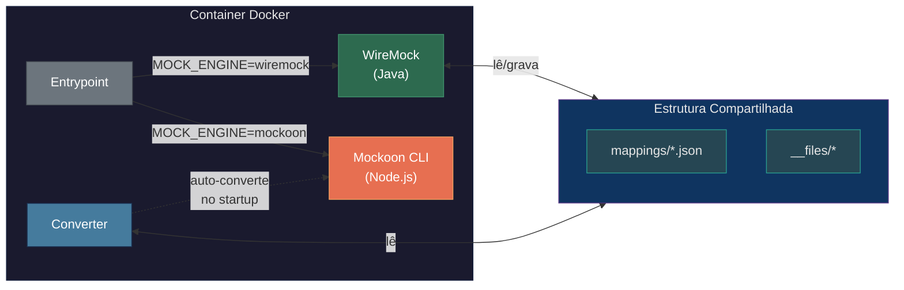
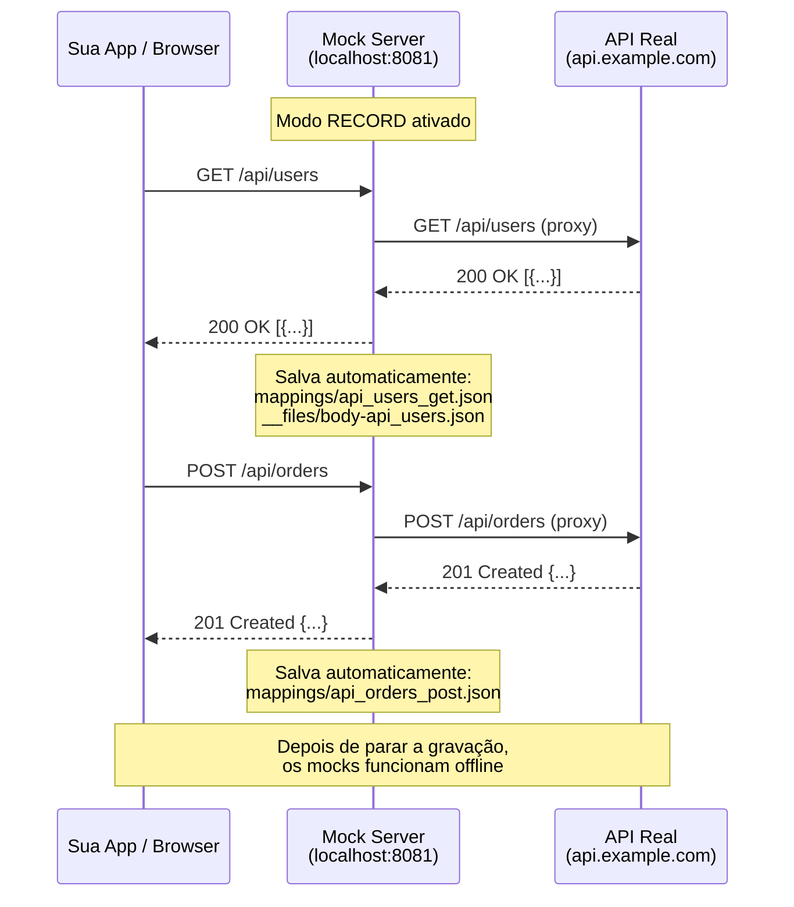
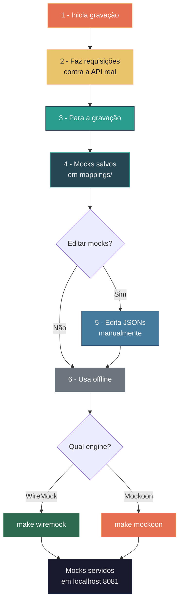
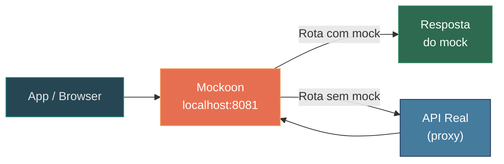
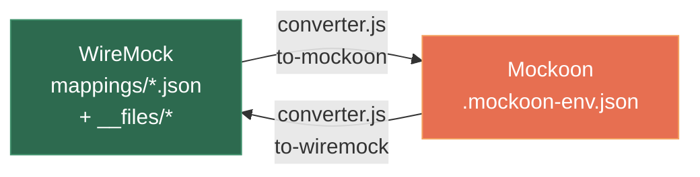
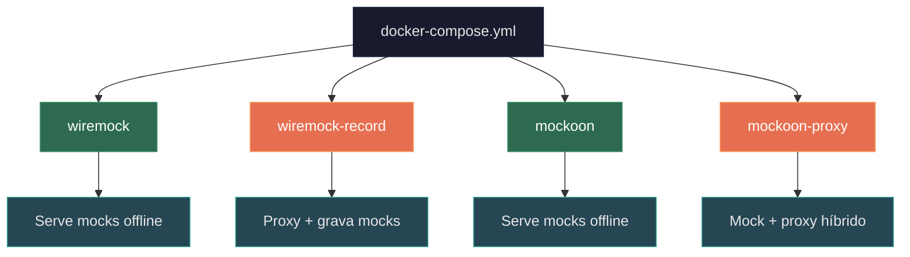

<div align="center">

# 🧪 Stubrix

### WireMock + Mockoon — Uma estrutura, dois engines

[](https://github.com/marcelo-davanco/stubrix)
[](#-quick-start)
[](#engines)
[](#engines)
[](LICENSE)

Container unificado para rodar **WireMock** ou **Mockoon CLI**, ambos compartilhando a mesma estrutura de mocks.  
**Foco principal: gravação rápida de mocks para uso offline.**

</div>

---

## Visão Geral



> **Conceito**: O formato canônico é o WireMock (`mappings/` + `__files/`) por ser o mais simples e universal.  
> Quando o Mockoon é ativado, o conversor gera automaticamente o formato nativo a partir dos mappings.

---

## Estrutura do Projeto

```
stubrix/
│
├── mocks/                            Estrutura canônica de mocks
│   ├── mappings/                       Definições de rotas (JSON)
│   │   └── example_health_get.json
│   └── __files/                        Body files referenciados
│       └── users.json
│
├── scripts/
│   ├── converter.js                  Conversor WireMock <-> Mockoon
│   ├── entrypoint.sh                 Entrypoint inteligente
│   ├── record.sh                     Helper de gravação (Admin API)
│   └── import-from-recording.sh      Importar mocks do container
│
├── Dockerfile                        Imagem multi-engine
├── docker-compose.yml                4 profiles disponíveis
├── Makefile                          Atalhos para tudo
└── .env.example                      Variáveis de exemplo
```

---

## Quick Start

### 1. Configure o `.env`

```bash
cp .env.example .env
```

Edite o `.env` conforme necessário:

```dotenv
# Porta do mock server (host + container)
MOCK_PORT=8081

# URL da API real (para gravação/proxy)
PROXY_TARGET=https://api.example.com
```

> O `.env` é carregado automaticamente pelo `Makefile`, `docker-compose` e scripts.

### 2. Build da imagem

```bash
make build
```

### 3. Escolha o engine e inicie

```bash
make wiremock     # ou
make mockoon
```

### 4. Teste

```bash
curl http://localhost:8081/api/health
# → {"status": "ok", "engine": "mock-server"}
```

> Para mudar a porta sem editar `.env`: `MOCK_PORT=9090 make wiremock`

---

## Gravação de Mocks

A funcionalidade mais importante deste projeto. Permite **criar mocks automaticamente** a partir de uma API real.

### Como a gravação funciona



---

### Opção A — Gravação Automática (mais simples)

Tudo que passar pelo proxy é gravado automaticamente.

```bash
# 1. Inicie em modo gravação apontando para a API real
make wiremock-record PROXY_TARGET=https://api.example.com

# 2. Faça requisições normalmente
curl http://localhost:8081/api/users
curl http://localhost:8081/api/products/42
curl -X POST http://localhost:8081/api/orders -d '{"item":"abc"}'

# 3. Pare o container
make down

# 4. Pronto! Mocks gravados em mocks/mappings/
make list-mappings
```

### Opção B — Gravação via API (mais controle)

Permite iniciar/parar a gravação sob demanda, sem reiniciar o container.

```bash
# 1. Inicie o WireMock normalmente
make wiremock

# 2. Em outro terminal, inicie a gravação
./scripts/record.sh start https://api.example.com

# 3. Faça suas chamadas
curl http://localhost:8081/api/users
curl http://localhost:8081/api/config

# 4. Pare a gravação (mocks são persistidos)
./scripts/record.sh stop

# 5. Verifique os mocks gravados
make list-mappings
```

### Opção C — Snapshot (captura pontual)

Captura o estado atual de todas as respostas sem modo de gravação contínua.

```bash
./scripts/record.sh snapshot
```

---

## Fluxo de Trabalho Completo



---

## Proxy Mode (Mockoon)

O Mockoon pode funcionar em modo **proxy híbrido**: rotas com mock definido retornam o mock, rotas sem mock são encaminhadas para a API real.



```bash
make mockoon-proxy PROXY_TARGET=https://api.example.com
```

---

## Anatomia de um Mock

### Inline body

```json
{
  "request": {
    "method": "GET",
    "url": "/api/health"
  },
  "response": {
    "status": 200,
    "headers": {
      "Content-Type": "application/json"
    },
    "body": "{\"status\": \"ok\"}"
  }
}
```

> Salvo em `mocks/mappings/api_health_get.json`

### Body em arquivo externo

```json
{
  "request": {
    "method": "GET",
    "url": "/api/users"
  },
  "response": {
    "status": 200,
    "headers": {
      "Content-Type": "application/json"
    },
    "bodyFileName": "users.json"
  }
}
```

> Mapping em `mocks/mappings/api_users_get.json`  
> Body em `mocks/__files/users.json`

---

## Conversão entre Formatos



```bash
# WireMock → Mockoon
make convert-to-mockoon

# Mockoon → WireMock
make convert-to-wiremock
```

> A conversão para Mockoon acontece **automaticamente** quando o engine Mockoon é iniciado. Você só precisa rodar manualmente se quiser inspecionar ou editar o arquivo gerado.

---

## Referência de Comandos

### Servir Mocks

| Comando | Engine | Descrição |
|:--------|:------:|:----------|
| `make wiremock` | WireMock | Serve mocks existentes |
| `make mockoon` | Mockoon | Serve mocks existentes (auto-converte) |

### Gravação

| Comando | Descrição |
|:--------|:----------|
| `make wiremock-record PROXY_TARGET=<url>` | Inicia WireMock gravando tudo via proxy |
| `./scripts/record.sh start <url>` | Inicia gravação via Admin API |
| `./scripts/record.sh stop` | Para gravação e persiste mocks |
| `./scripts/record.sh snapshot` | Captura pontual do estado atual |
| `./scripts/record.sh status` | Verifica se está gravando |

### Proxy

| Comando | Descrição |
|:--------|:----------|
| `make mockoon-proxy PROXY_TARGET=<url>` | Mockoon híbrido: mock + proxy |

### Conversão

| Comando | Descrição |
|:--------|:----------|
| `make convert-to-mockoon` | Gera `.mockoon-env.json` a partir dos mappings |
| `make convert-to-wiremock` | Gera mappings a partir de `.mockoon-env.json` |

### Utilitários

| Comando | Descrição |
|:--------|:----------|
| `make build` | Build da imagem Docker |
| `make down` | Para todos os containers |
| `make list-mappings` | Lista mocks e body files existentes |
| `make clean` | Remove containers e arquivos gerados |
| `make clean-mocks` | Remove **todos** os mocks (cuidado!) |
| `make help` | Lista todos os comandos disponíveis |

---

## Variáveis de Ambiente

| Variável | Default | Descrição |
|:---------|:-------:|:----------|
| `MOCK_PORT` | `8081` | Porta no host e dentro do container |
| `PROXY_TARGET` | — | URL da API real para proxy/gravação |
| `MOCK_ENGINE` | `wiremock` | Engine: `wiremock` ou `mockoon` |
| `RECORD_MODE` | `false` | Ativa gravação automática (WireMock) |

> Todas as variáveis podem ser definidas no `.env` (carregado automaticamente) ou passadas inline: `MOCK_PORT=9090 make wiremock`

---

## Docker Compose — Profiles



```bash
# Uso direto (sem Makefile)
docker compose --profile wiremock up
docker compose --profile mockoon up
PROXY_TARGET=https://api.example.com docker compose --profile wiremock-record up
PROXY_TARGET=https://api.example.com docker compose --profile mockoon-proxy up
```

---

## Cenários de Uso

### Desenvolvimento Offline

> Preciso trabalhar sem internet mas minha app depende de 3 APIs externas.

```bash
# 1. Com internet, grave os mocks de cada API
make wiremock-record PROXY_TARGET=https://api-users.example.com
# use a app... depois pare
make down

# 2. Repita para outras APIs ou use record via API para múltiplas

# 3. Sem internet, sirva os mocks
make wiremock
```

### Testes de Integração em CI

> Preciso de mocks estáveis no pipeline de CI.

```bash
# Grave uma vez localmente, commite os mocks
make wiremock-record PROXY_TARGET=https://staging.api.com
make down
git add mocks/ && git commit -m "add API mocks"

# No CI
docker compose --profile wiremock up -d
npm test
docker compose --profile wiremock down
```

### Trocar de Engine sem Retrabalho

> O time decidiu migrar de WireMock para Mockoon (ou vice-versa).

```bash
# Mesmos mocks, engine diferente
make wiremock   # antes
make mockoon    # depois — zero mudanças nos mocks
```

---

## Guias Práticos

| Guia | Descrição |
|:-----|:----------|
| [Gravação com PokéAPI + Postman](docs/guide-pokeapi-recording.md) | Passo a passo completo: gravar mocks da PokéAPI, servir offline e usar via Postman Collection |

---

## Licença

MIT — veja [LICENSE](LICENSE) para detalhes.

---

<div align="center">

**Stubrix** — feito com ☕ por [Marcelo Davanço](https://github.com/marcelo-davanco)

</div>
