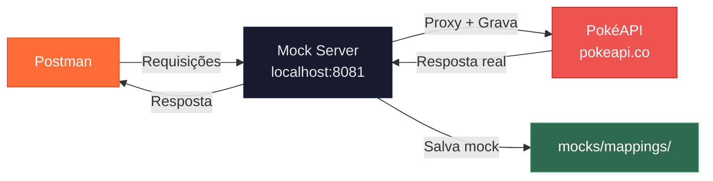
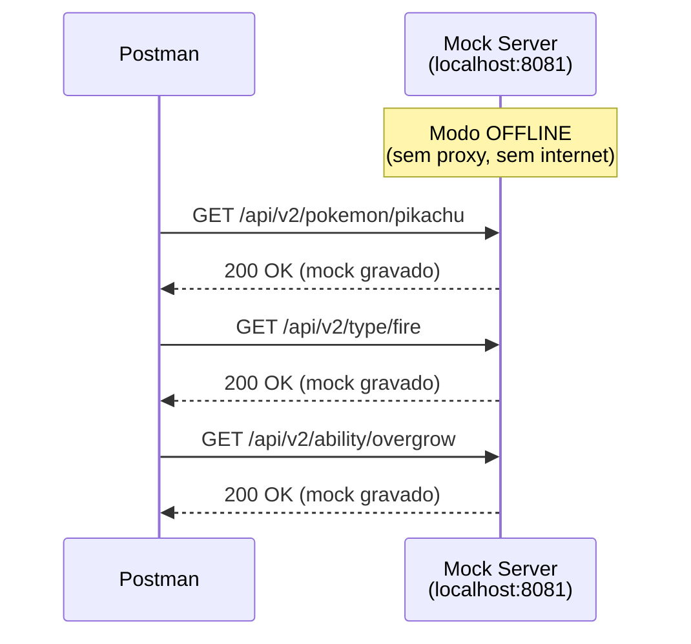
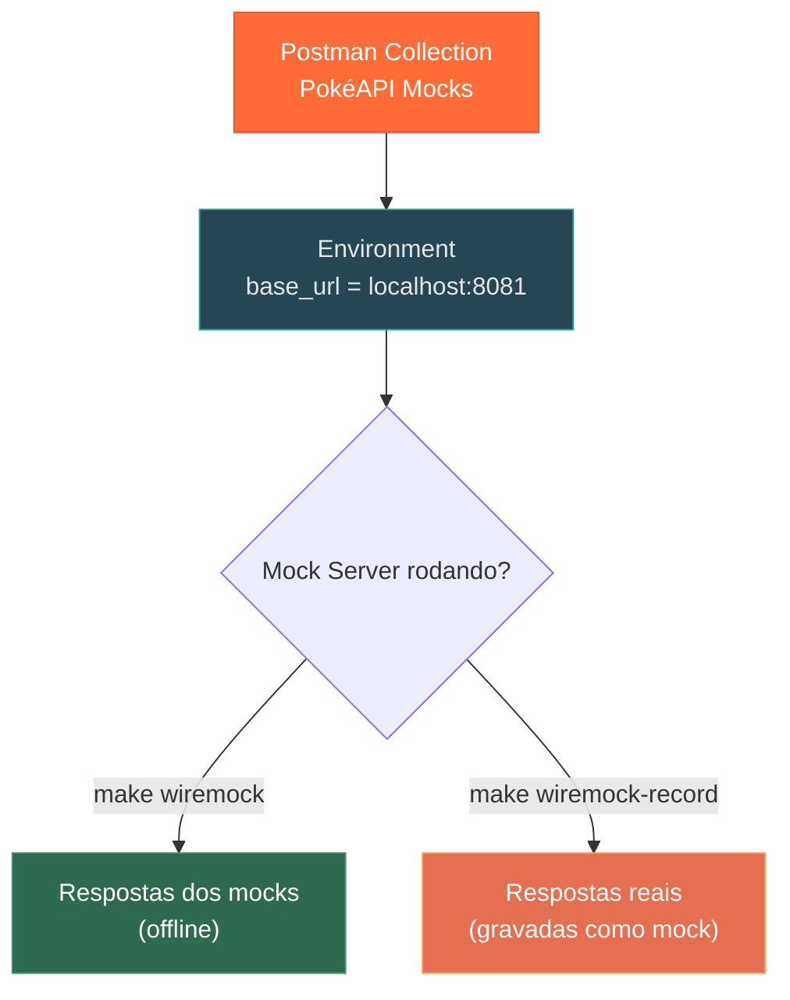
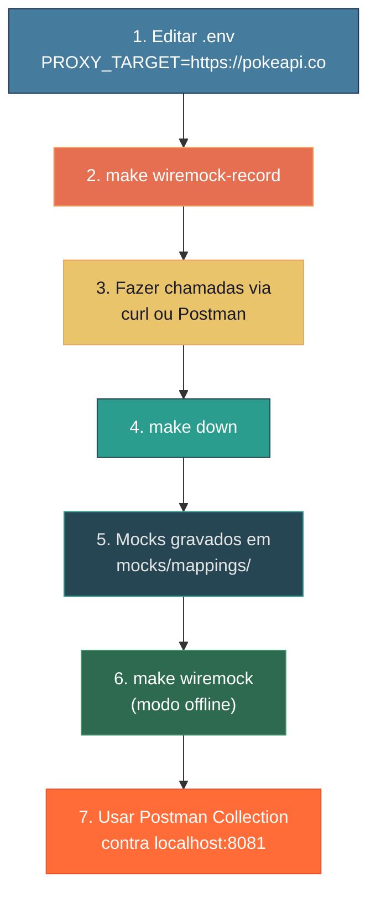

<div align="center">

# Stubrix — Guia Prático: Gravação de Mocks com PokéAPI

### Passo a passo: gravar, servir offline e usar no Postman

</div>

---

## Objetivo

Vamos usar a [PokéAPI](https://pokeapi.co/) como API real para demonstrar o fluxo completo:

1. **Gravar** todas as chamadas como mocks automaticamente
2. **Servir** os mocks offline (sem depender da internet)
3. **Importar** uma Collection no Postman para consumir os mocks



---

## Pré-requisitos

- Docker instalado e rodando
- Postman (ou qualquer client HTTP)
- Projeto `mocks-servers` com build feito (`make build`)

---

## Etapa 1 — Configurar o `.env`

Edite o arquivo `.env` na raiz do projeto:

```dotenv
MOCK_PORT=8081
PROXY_TARGET=https://pokeapi.co
```

---

## Etapa 2 — Iniciar Gravação

```bash
make wiremock-record
```

Você verá no terminal:

```
============================================
  Mock Server Container
  Engine:       wiremock
  Port:         8081
  Record Mode:  true
  Proxy Target: https://pokeapi.co
============================================
[wiremock] Starting in RECORD mode -> https://pokeapi.co
```

> A partir de agora, **toda requisição** feita em `http://localhost:8081` será:
> 1. Enviada para `https://pokeapi.co` (proxy)
> 2. A resposta real é retornada para você
> 3. Um mock é salvo automaticamente em `mocks/mappings/`

---

## Etapa 3 — Fazer as Requisições

Abra outro terminal e faça as chamadas. Cada uma delas será gravada:

### 3.1 — Listar Pokémons (primeiros 5)

```bash
curl -s http://localhost:8081/api/v2/pokemon?limit=5 | jq .
```

### 3.2 — Detalhes do Pikachu

```bash
curl -s http://localhost:8081/api/v2/pokemon/pikachu | jq .name,.id,.height,.weight
```

### 3.3 — Detalhes do Charizard

```bash
curl -s http://localhost:8081/api/v2/pokemon/charizard | jq .name,.id,.types
```

### 3.4 — Tipo Fogo

```bash
curl -s http://localhost:8081/api/v2/type/fire | jq .name,.pokemon[:3]
```

### 3.5 — Habilidade "Overgrow"

```bash
curl -s http://localhost:8081/api/v2/ability/overgrow | jq .name,.effect_entries[0].short_effect
```

### 3.6 — Espécie do Bulbasaur

```bash
curl -s http://localhost:8081/api/v2/pokemon-species/bulbasaur | jq .name,.flavor_text_entries[0].flavor_text
```

### 3.7 — Cadeia de Evolução

```bash
curl -s http://localhost:8081/api/v2/evolution-chain/1 | jq .chain.species.name,.chain.evolves_to[0].species.name
```

### 3.8 — Geração 1

```bash
curl -s http://localhost:8081/api/v2/generation/1 | jq .name,.main_region.name
```

---

## Etapa 4 — Parar a Gravação

Volte ao terminal onde o container está rodando e pressione `Ctrl+C`, ou em outro terminal:

```bash
make down
```

---

## Etapa 5 — Verificar os Mocks Gravados

```bash
make list-mappings
```

Você verá algo como:

```
=== WireMock Mappings ===
-rw-r--r--  mocks/mappings/api_v2_pokemon-limit=5.json
-rw-r--r--  mocks/mappings/api_v2_pokemon_pikachu.json
-rw-r--r--  mocks/mappings/api_v2_pokemon_charizard.json
-rw-r--r--  mocks/mappings/api_v2_type_fire.json
-rw-r--r--  mocks/mappings/api_v2_ability_overgrow.json
-rw-r--r--  mocks/mappings/api_v2_pokemon-species_bulbasaur.json
-rw-r--r--  mocks/mappings/api_v2_evolution-chain_1.json
-rw-r--r--  mocks/mappings/api_v2_generation_1.json

=== Response Files ===
(body files referenciados pelos mappings)
```

---

## Etapa 6 — Servir Offline

Agora os mocks funcionam **sem internet**:

```bash
make wiremock
# ou
make mockoon
```

Teste:

```bash
curl -s http://localhost:8081/api/v2/pokemon/pikachu | jq .name
# → "pikachu"
```



---

## Etapa 7 — Importar Collection no Postman

### Opção A — Importar arquivo JSON

1. Abra o Postman
2. Clique em **Import** (canto superior esquerdo)
3. Selecione o arquivo `docs/postman-pokeapi-collection.json` deste projeto
4. A collection **PokéAPI Mocks** aparecerá no sidebar

### Opção B — Importar via URL (se publicar o projeto)

```
File → Import → Link → cole a URL raw do arquivo no GitHub
```

### Configurar a variável de ambiente no Postman

A collection usa a variável `{{base_url}}`. Configure-a:

1. Vá em **Environments** → **New Environment**
2. Crie a variável:

| Variable | Initial Value | Current Value |
|:---------|:-------------|:-------------|
| `base_url` | `http://localhost:8081` | `http://localhost:8081` |

3. Selecione esse environment no canto superior direito

### Usar a Collection



Agora basta clicar em qualquer request da collection e enviar!

---

## Fluxo Resumido



---

## Dica: Gravar Mais Endpoints

Sempre que precisar de novos mocks, basta:

```bash
# 1. Inicie a gravação
make wiremock-record

# 2. Faça as novas chamadas
curl http://localhost:8081/api/v2/pokemon/mewtwo
curl http://localhost:8081/api/v2/move/thunderbolt

# 3. Pare
make down

# Os novos mocks são adicionados aos existentes (não sobrescreve)
```

---

## Troubleshooting

| Problema | Solução |
|:---------|:--------|
| `port is already allocated` | Mude `MOCK_PORT` no `.env` para outra porta livre |
| Mock retorna 404 | A URL precisa bater exatamente com a gravada (incluindo query params) |
| Postman não conecta | Verifique se o container está rodando (`docker ps`) |
| Quer regravar um endpoint | Delete o JSON correspondente em `mocks/mappings/` e regrave |
